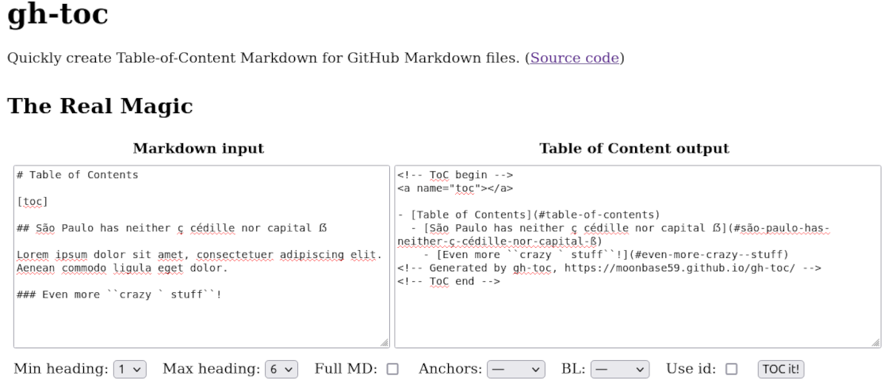
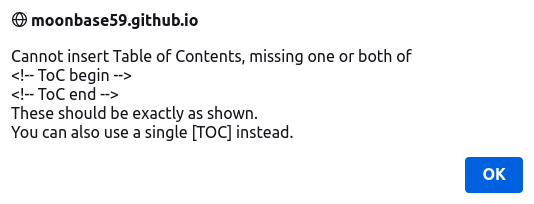

# <a name="gh-toc"></a>gh-toc <a href="#toc" class="goToc">⇧</a>

Quickly create Table-of-Content Markdown for GitHub Markdown files.



## <a name="table-of-contents-made-with-gh-toc"></a>Table of Contents _(made with gh-toc)_ <a href="#toc" class="goToc">⇧</a>

<!-- ToC begin -->
<a name="toc"></a>

- [gh-toc](#gh-toc)
  - [Table of Contents _(made with gh-toc)_](#table-of-contents-made-with-gh-toc)
  - [Overview](#overview)
  - [Test file](#test-file)
  - [Conversion to HTML, using auto-generated HTML anchors](#conversion-to-html-using-auto-generated-html-anchors)
  - [Conversion to HTML, using auto-generated {#…} anchors](#conversion-to-html-using-auto-generated--anchors)
  - [More features](#more-features)
    - [Generated Markdown using _Anchors: HTML_ and _BL: ⇧ToC_](#generated-markdown-using-anchors-html_-and-_bl-toc)
    - [Generated Markdown using _Anchors: {#…}_ and _BL: ⇧ToC_](#generated-markdown-using-anchors-_-and-_bl-toc)
    - [From simple Table of Contents…](#from-simple-table-of-contents)
    - [… to full-fledged Markdown with anchors and backlinks!](#-to-full-fledged-markdown-with-anchors-and-backlinks)
    - [Warning if ToC cannot be inserted into full Markdown](#warning-if-toc-cannot-be-inserted-into-full-markdown)
    - [Styling the backlinks with CSS](#styling-the-backlinks-with-css)
  - [The evolution of a "simple" tool](#the-evolution-of-a-simple-tool)
  - [Known problems](#known-problems)
  - [The Real Magic](#the-real-magic)
<!-- Generated by gh-toc, https://moonbase59.github.io/gh-toc/ -->
<!-- ToC end -->

## <a name="overview"></a>Overview <a href="#toc" class="goToc">⇧</a>

> I could never find a _**do-it-all**_, easy to use, online Table-of-Content maker for GitHub (and other) Markdown files. There were many solutions that required downloading or installing something on my computer. For such a trivial task I felt that was unnecessary. 

Indeed. This began as a [fork](https://imthenachoman.github.io/nGitHubTOC/) and has meanwhile evolved to a _full-fledged solution:_

- Full Unicode support, all international characters.
- Better handling of (hopefully) all underscore cases.
- Correct handling of ``code with backticks ` inside``.
- Much better code block support (indented, backticks, tildes, different number of backticks/tildes).
- YAML/Jekyll/LaTeX front matter support.
- Optional output of the full Markdown file instead of just the ToC. ToC inserted between `<!-- ToC begin -->` and `<!-- ToC end -->` HTML comments, or at `[TOP]`. You _can_ insert the ToC multiple times, although I don’t see a use case for that.
- GitHub, HTML and [Pandoc](https://pandoc.org/)/[PHP Markdown Extra](https://michelf.ca/projects/php-markdown/extra/)-compatible anchor generation for easy navigation.
- Optional **backlink** generation, to either Top or Table of Contents.
- Optional use of `id` instead of `name` attribute in generated HTML anchors.
- Automatic cleanup of HTML anchor & backlink code left over from previous runs. That means you can now input a file from a previous run _with_ anchors & backlinks, and output it again _without_.

**None of your data is transferred to the Internet.** All work happens in your browser, using JavaScript.

I did lots of testing, rewrote the link generation and added extra functionality, to be as compatbile with GitHub (and others) as possible. And then some. It works great, even for difficult cases.

Note _gh-toc_ works with ATX-type headings (`###`). It doesn’t try to parse for Setext (`===`/`---`) or HTML (`<h3>`) headings.

**No other online ToC-Generator I could find handled all the test cases below correctly!**

## <a name="test-file"></a>Test file <a href="#toc" class="goToc">⇧</a>

[testing.md](testing.md) is a sample Markdown file with many test cases. Copy its contents into the input box of gh-toc to see what gets generated.

## <a name="conversion-to-html-using-auto-generated-html-anchors"></a>Conversion to HTML, using auto-generated HTML anchors <a href="#toc" class="goToc">⇧</a>

This syntax is compatible with GitHub and almost anything that generates HTML from Markdown, but the HTML is slightly harder to read. You can select if you want `name=` (default) or `id=` HTML anchors generated.

It will generate HTML anchors of the form

```markdown
# <a name="gh-toc"></a>gh-toc
```
in the Markdown file, which Pandoc then converts to this HTML:

```html
<h1><a name="gh-toc"></a>gh-toc</h1>
```

1. Copy-paste the contents of `testing.md` into the _left_ input box of [gh-toc](https://moonbase59.github.io/gh-toc/).
2. Select
   - Minimum heading level: 1
   - Maximum heading level: 6
   - Full MD: ☑
   - Anchors: HTML
   - BL: ⇧ToC (or any other)
   - Use id: ☐
3. Click `TOC it!` and watch the magic.
4. Copy-paste the contents of the _right_ input box into a text editor and save as `testing-html-anchors.md`.
5. Convert to HTML using [_Pandoc_](https://pandoc.org/):
   ```bash
   pandoc -s -f markdown-auto_identifiers+yaml_metadata_block -t html testing-html-anchors.md -o testing-html-anchors.html
   ```
6. Open [`testing-html-anchors.html`](https://moonbase59.github.io/gh-toc/testing-html-anchors.html) in your favourite browser and test the links.

Or watch the generated [`testing-html-anchors.md`](testing-html-anchors.md) _on GitHub_—it works beautifully here. **No more endless scrolling in README.md files!**

**Voilà. Enjoy!**

## <a name="conversion-to-html-using-auto-generated--anchors"></a>Conversion to HTML, using auto-generated {#…} anchors <a href="#toc" class="goToc">⇧</a>

This syntax is compatible with [_Pandoc_](https://pandoc.org/) and [_PHP Markdown Extra_](https://michelf.ca/projects/php-markdown/extra/), for example.

It will generate header attributes of the form

```markdown
# gh-toc {#gh-toc}
```
in the Markdown file, which Pandoc then converts to this HTML:

```html
<h1 id="gh-toc">gh-toc</h1>
```

1. Copy-paste the contents of `testing.md` into the _left_ input box of [gh-toc](https://moonbase59.github.io/gh-toc/).
2. Select
   - Minimum heading level: 1
   - Maximum heading level: 6
   - Full MD: ☑
   - Anchors: {#…}
   - BL: —
   - Use id: ☐
3. Click `TOC it!` and watch the magic.
4. Copy-paste the contents of the _right_ input box into a text editor and save as `testing-curly-anchors.md`.
5. Convert to HTML using [_Pandoc_](https://pandoc.org/):
   ```bash
   pandoc -s -f markdown+yaml_metadata_block -t html testing-curly-anchors.md -o testing-curly-anchors.html
   ```
6. Open [`testing-curly-anchors.html`](https://moonbase59.github.io/gh-toc/testing-curly-anchors.html) in your favourite browser and test the links.

**Voilà again!**

## <a name="more-features"></a>More features <a href="#toc" class="goToc">⇧</a>

Also try the other options, like auto-generated backlinks to ⇧Top or ⇧ToC next to each heading! Backlinks use CSS classes `goTop` and `goToc`, so you can even _style_ them!

### <a name="generated-markdown-using-anchors-html_-and-_bl-toc"></a>Generated Markdown using _Anchors: HTML_ and _BL: ⇧ToC_ <a href="#toc" class="goToc">⇧</a>

```markdown
# <a name="gh-toc"></a>gh-toc <a href="#toc" class="goToc">⇧</a>
```

### <a name="generated-markdown-using-anchors-_-and-_bl-toc"></a>Generated Markdown using _Anchors: {#…}_ and _BL: ⇧ToC_ <a href="#toc" class="goToc">⇧</a>

```markdown
# gh-toc <a href="#toc" class="goToc">⇧</a> {#gh-toc}
```

### <a name="from-simple-table-of-contents"></a>From simple Table of Contents… <a href="#toc" class="goToc">⇧</a>


### <a name="-to-full-fledged-markdown-with-anchors-and-backlinks"></a>… to full-fledged Markdown with anchors and backlinks! <a href="#toc" class="goToc">⇧</a>


### <a name="warning-if-toc-cannot-be-inserted-into-full-markdown"></a>Warning if ToC cannot be inserted into full Markdown <a href="#toc" class="goToc">⇧</a>



### <a name="styling-the-backlinks-with-css"></a>Styling the backlinks with CSS <a href="#toc" class="goToc">⇧</a>

Yes, you can! Generated backlinks use the classes `goToc` and `goTop`, respectively. The `testing.md` document includes my really wild example [`gh-toc.css`](gh-toc.css) so you can see the effects possible.

A simpler approach might be just setting the up arrows to 50% opacity and remove the link underlines:

```css
/* An example for styling the backlinks.
 * 
 * Let’s make them 50% opaque and remove the link underline.
 * 
 */

.goToc {
    text-decoration: none;
    opacity: 0.5;
}

.goTop {
    text-decoration: none;
    opacity: 0.5;
}
```

## <a name="the-evolution-of-a-simple-tool"></a>The evolution of a "simple" tool <a href="#toc" class="goToc">⇧</a>

It all started out because I looked for a quick way to generate a GitHub README Table-of-Contents. Looking around, most solutions required installing some software my system. No problem so far, but I work on a lot of machines, different operating systems and all. So it would never simply be _available_.

Ok, a web page it should be. Accessible everywhere, and _simple_. Copy-paste is no witchcraft, after all: <kbd>Ctrl</kbd>+<kbd>A</kbd>, <kbd>Ctrl</kbd>+<kbd>C</kbd> for copy, then <kbd>Ctrl</kbd>+<kbd>A</kbd>, <kbd>Ctrl</kbd>+<kbd>V</kbd> to paste back.

Looking around, I liked [IMTheNachoMan’s nGitHubTOC](https://imthenachoman.github.io/nGitHubTOC/) best, but quickly stumbled upon problems with it: Code block and underline issues, for instance. Then I currently live in Germany, and we have some funny characters like <kbd>äöüßÄÖÜ</kbd>. Oh yes, and now the capital <kbd>ẞ</kbd>. Which didn’t work. At least it didn’t generate anchors that would work in GitHub.

So I decided to _fork_ the project and fix some bugs… **And the story began.**

I looked at the code and tried to reverse-engineer how GitHub generate their anchors (which work really well and have great Unicode support). After setting up test cases, from my own documents, and then some more, I found the original structure of the program to be good, but it needed intensive polishing-up to handle lots of Markdown quirks and special cases.

You can look up my [commits](https://github.com/Moonbase59/gh-toc/commits/master/) to follow what I did, if you like. It took a few days until it really did what I wanted.

Now, as it worked with the basics, and had a good structure, I started thinking _options_. Rabbit hole, know that? What if I wouldn’t need to copy-paste and insert the ToC _manually_, but it would _auto-insert_ it for me? And output _the complete Markdown_? **_FullMD_ was born.**

Oops, it messed up my long LaTeX _front matter_! Oh, and I’d use that for dates and versions, too. And Jekyll. I was _so_ tired of seeing H1 level front matter comments! **So let’s create front matter handling.**

Some people in various forums had hot discussions about whether to use `name` or `id` in HTML anchors. Hmm… **Why not have an option to _switch_ between these?**

Talking _anchors_, **why not include an automatic anchor for the ToC** (because I always forgot to). While we’re at it, think of people wanting to **go to the Top** of the document, too. (Auto-generated when you use _BL: ⇧Top_.)

**Not everything is GitHub.** So let’s _use_ the GitHub anchors and find a way to include anchors _on the actual headings_ when _not_ using GitHub (they do it automatically when previewing Markdown files). It actually took a while, and lots of reading and testing, to find a way that would work "everywhere", from GitHub to Pandoc-generated HTML, because Markdown doesn’t support it natively. Fortunately it _does_ support using HTML code, so the most compatible way could be found. **_Anchor_ was created.** You can switch between no anchors, HTML, and the curly bracket notation.

Now what **frustrates** me and others most when reading my ultralong READMEs? Right! **Not being able to jump back to the Table of Contents!** We’re creating anchors anyway, so **why not add a backlink feature?** Now this should work with minimal or no effort, and both on GitHub and files that are later post-processed into HTML. It should be **unobtrusive**, like the little up-arrow many web pages show nowadays to go to `⇧Top`. Oh, and **stylable using CSS**. And hey, why not let me choose between **⇧Top** and **⇧Toc** jumping? What I eventually liked best was **a little stylable up-arrow at the right end of each heading**, technically _inside_ the heading. And of course the **_BL_** (backlink) selection.

I’m _so_ awfully happy. I can now copy-paste my README into _gh-toc_, select options, and out comes a readily-usable, linked and backlinked file that _works_. On GitHub and elsewhere.

Oops. Generated all this nice anchor and backlink stuff, uploaded my README, and now need to change it and output it _without_ anchors and backlinks. And _gh-toc_ would _leave the old stuff all in!_ Okay, next step: **Auto-cleanup of artifacts left over from previous runs!** This works even on headings _you don’t touch this time._ Let’s say you output heading levels 1–6 last time, generating anchors and backlinks for them, and now you only want to output levels 2–6. Normally, _gh-toc_ will only touch as few of your Markdown code lines as possible, but in this case it makes sense to also remove the now-obsolete level 1 anchors & backlinks from the previous run.

Now I’m _really_ happy. Until I find the next feature, that is…

I _love_ CSS. And I’d maybe like a little  symbol better than the arrow. Hmm. Unicode (currently) has no symbol for an unordered list, so let’s create one, `gh-toc.svg`. But then, how to get that into CSS? A little CSS hacking might be possible, after all… Let’s show how I’ve done it, and include the [sample CSS](gh-toc.css) in the HTML example.

_Q.E.D._: Anything goes with CSS!

> **And _now_ you know the rest of the story! (So far.)**


## <a name="known-problems"></a>Known problems <a href="#toc" class="goToc">⇧</a>

- ~~_gh-toc_ will "brute-force replace" all text between the ToC start  marker `<!-- ToC begin -->` and the end marker `<!-- ToC end -->` with the new Table of Contents, _even if they are in a code block_. Avoid that for now, or don’t use the _Full MD_ option in this case and insert the ToC manually.~~
  _Now fixed and ToC inserting/replacing is safe, even if the "ToC begin/end" comments are out of sequence or one is missing. An alert will pop up if none are found and the ToC cannot be inserted in FullMD mode._

- Selecting _FullMD_ + _Anchor: \{\#…\}_ will overwrite other than anchor definitions within the curly braces, i.e. `{#anchor .red}` → `{#new-anchor}`. Selecting _Anchor: –_ (None) doesn’t modify existing curly brace definitions.

## <a name="the-real-magic"></a>The Real Magic <a href="#toc" class="goToc">⇧</a>

https://moonbase59.github.io/gh-toc/
